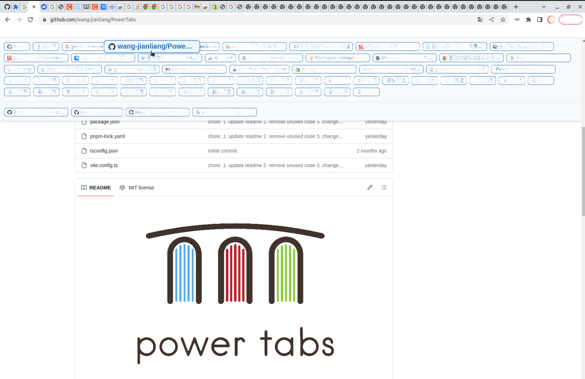

<h1> A browser extension that makes it easier for you to access your browser tabs</h1>

## Table of Contents

- [Intro](#intro)
- [Installation](#installation)
    - [Procedures](#procedures)
        - [Chrome](#chrome)
        - [Firefox](#firefox)
- [Contributors](#contributors)

## Intro 

PowerTabs allows you to quickly locate the desired page among a large number of browser tabs. It adds a dropdown menu to your browser, which contains tabs corresponding to all currently open pages. By clicking on a tab, you can quickly navigate to the corresponding page.

## Installation 

## Procedures: 

1. Clone this repository.
2. Install pnpm globally: `npm install -g pnpm` (check your node version >= 16.6, recommended >= 18)
3. Run `pnpm install`

## And next, depending on the needs:

### For Chrome: 

1. Run:
    - Dev: `pnpm dev` or `npm run dev`
    - Prod: `pnpm build` or `npm run build`
2. Open in browser - `chrome://extensions`
3. Check - `Developer mode`
4. Find and Click - `Load unpacked extension`
5. Select - `dist` folder

### For Firefox: 

1. Run:
    - Dev: `pnpm dev:firefox` or `npm run dev:firefox`
    - Prod: `pnpm build:firefox` or `npm run build:firefox`
2. Open in browser - `about:debugging#/runtime/this-firefox`
3. Find and Click - `Load Temporary Add-on...`
4. Select - `manifest.json` from `dist` folder

## Contributors 

<!-- ALL-CONTRIBUTORS-LIST:START - Do not remove or modify this section -->
<!-- prettier-ignore-start -->
<!-- markdownlint-disable -->
<table>
  <tbody>
    <tr>
      <td align="center" valign="top" width="14.28%"><a href="https://github.com/wang-jianliang"> <b>wang-jianliang</b></a> 
    </tr>
  </tbody>
</table>

<!-- markdownlint-restore -->
<!-- prettier-ignore-end -->

<!-- ALL-CONTRIBUTORS-LIST:END -->

---

## Thanks To

- [chrome-extension-boilerplate-react-viteJetbrains](https://github.com/Jonghakseo/chrome-extension-boilerplate-react-vite)